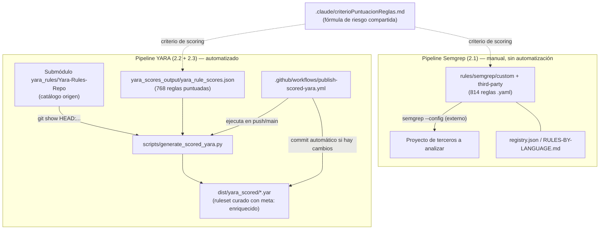

# Registro de progreso - Pablo Jiménez Castro

## Metadatos

- **Responsable:** Pablo Jiménez Castro (`pablojimenezcastro@uma.es`, commits como `pablojimz`)
- **Última actualización:** 2026-08-28
- **Estado general:** En desarrollo activo — dataset curado de reglas SAST/YARA con automatización parcial
- **Última revisión realizada por:** Asistente Claude Code, a petición de Pablo Jiménez Castro
- **Componentes registrados:** Reglas Semgrep (`rules/semgrep/`), Motor de scoring y generación de YARA (`scripts/generate_scored_yara.py` + `yara_scores_output/` + submódulo `yara_rules/Yara-Rules-Repo`), Pipeline de publicación automática (`.github/workflows/publish-scored-yara.yml`)

> **Nota sobre el alcance de este documento.** La plantilla original de este registro pedía documentar componentes llamados **CLI**, **shortcircuit** y **deps_layers**. Tras analizar el repositorio completo (estructura de directorios, historial de commits, contenido de ficheros) se confirma que **ninguno de los tres existe** en `Repo-reglas-SEMGREP-y-YARA` — ni como código, ni como mención en documentación. Este repositorio es un catálogo de reglas Semgrep/YARA para análisis estático (SAST), no una aplicación con esa arquitectura. Por decisión explícita de Pablo Jiménez Castro (2026-08-07), este documento pasa a registrar los **componentes reales** de los que hay evidencia en el código y de los que él es el único autor según `git log` (ver [sección 2.4](#24-componentes-buscados-y-no-encontrados-en-el-repositorio) para el detalle de la comprobación). Si en el futuro se incorpora un módulo `CLI`, `shortcircuit` o `deps_layers` a este repositorio, esta nota debe eliminarse y sustituirse por su documentación real siguiendo la misma plantilla.

---

# 1. Resumen general

`Repo-reglas-SEMGREP-y-YARA` es un repositorio de reglas de Análisis Estático de Código (SAST) y detección basada en YARA, sin código de aplicación propio: es esencialmente **datos + configuración + un script de transformación + un workflow de CI**. Todo el trabajo activo registrado en `git log` corresponde a un único autor, `pablojimz` (Pablo Jiménez Castro); existe un segundo autor histórico, `elpeloncho`, cuyos commits no se han localizado en el `git log` actual del repositorio con reglas — pendiente de confirmar su alcance y si sigue activo.

El trabajo de Pablo cubre dos líneas independientes y no acopladas entre sí:

1. **Reglas Semgrep** (`rules/semgrep/`): ~814 reglas (64 propias + 750 de terceros) en 17 lenguajes, cada una con una puntuación de riesgo (`risk_score`) calculada según una fórmula ponderada documentada en `.claude/criterioPuntuacionReglas.md`.
2. **Reglas YARA puntuadas y publicadas** (`scripts/generate_scored_yara.py`, `yara_scores_output/`, `dist/yara_scored/`): un script que toma un subconjunto puntuado de reglas del submódulo `Yara-Rules-Repo` y genera un ruleset YARA autocontenido con los scores incrustados en el `meta:` de cada regla, publicado automáticamente vía GitHub Actions.

La parte Semgrep está más completa en volumen de reglas pero su proceso de scoring es manual/asistido por LLM y no está automatizado ni validado por script. La parte YARA cubre 3 de las ~15 categorías del submódulo origen (**768 reglas puntuadas**: `antidebug_antivm` 54, `webshell` 640, `exploit_kit` 74, tras incorporar `exploit_kits/` el 2026-08-28), pero sí tiene un pipeline reproducible y automatizado de extremo a extremo (script + CI que commitea el resultado).

---

# 2. Componentes analizados

## 2.1 Reglas Semgrep (`rules/semgrep/`)

### Información básica

- **Responsable:** Pablo Jiménez Castro
- **Ubicación en el proyecto:** `rules/semgrep/`
- **Estado actual:** Activo, en crecimiento
- **Última revisión:** commit `f6c6fb4` (2026-08-06) — "Add new Semgrep rules for HTML vulnerabilities and update RULES-BY-LANGUAGE.md table"
- **Nivel de madurez:** Medio — contenido extenso y consistente, pero con metadatos de gobernanza (`CODEOWNERS`) sin completar

### Historial de cambios

| Fecha | Cambio realizado | Motivo | Responsable |
|------|------------------|--------|-------------|
| 2026-08-05 | `a596834` — carga inicial de reglas Semgrep | Arranque del repositorio de reglas | pablojimz |
| 2026-08-05 | `ab09064` — añadidas todas las reglas third-party y sus risk scores | Incorporar catálogos externos (Trail of Bits, opengrep, 0xdea) | pablojimz (co-autor: Claude Sonnet 5) |
| 2026-08-05 | `78f232a` / `bd96000` — risk scores aplicados a todas las reglas Semgrep + Git LFS para YAML | Puntuar el catálogo completo y evitar que los YAML infladen el repo git | pablojimz |
| 2026-08-06 | `f6c6fb4` — nuevas reglas HTML + actualización de `RULES-BY-LANGUAGE.md` | Ampliar cobertura de lenguajes | pablojimz |

### Estado actual

**Implementado:**
- Reglas propias (`custom/`) en 17 lenguajes: bash, c, clojure, csharp, dockerfile, html, java, javascript, json, ocaml, php, powershell, python, regex, ruby, rust, swift. 64 ficheros `.yaml` de regla, cada uno con su caso de prueba vulnerable/seguro asociado.
- Reglas de terceros (`third-party/`) de Trail of Bits, opengrep y 0xdea (750 ficheros `.yaml`), indexadas en `registry.json` (778 reglas totales) con `source`, `license` y `upstream_version` por regla.
- Cada regla incluye metadata de riesgo (`severity_score`, `confidence_score`, `exploitability_score`, `risk_score`, `risk_justification`) según la fórmula documentada en `.claude/criterioPuntuacionReglas.md`.
- `RULES-BY-LANGUAGE.md` como índice de navegación rápida; `NOTICE.md` para licencias; `CONTRIBUTING.md` con checklist detallado para incorporar nuevas fuentes third-party (compatibilidad de licencias, copia literal del texto de licencia, actualización de `registry.json`, etc.).

**Pendiente / limitaciones conocidas:**
- `CODEOWNERS` contiene placeholders literales `@TU_USUARIO_O_EQUIPO` sin rellenar en todas sus líneas — no hay owners reales asignados.
- No existe ningún workflow de CI que ejecute `semgrep --test rules/semgrep/` automáticamente; el README documenta el comando pero su ejecución es manual (Pendiente de confirmar si se ejecuta como parte de algún proceso externo al repositorio).
- El cálculo de `risk_score` para reglas Semgrep no está respaldado por ningún script (a diferencia de la parte YARA, ver 2.2); depende de que quien añade la regla siga manualmente el criterio de `.claude/criterioPuntuacionReglas.md`.

### Arquitectura e integración

- **Responsabilidad:** proporcionar un catálogo de reglas de detección estática, consumible por la herramienta externa `semgrep` (no incluida en este repo), para analizar *otros* proyectos.
- **Módulos con los que interactúa:** ninguno dentro de este repositorio — es independiente del pipeline YARA (2.2/2.3). Ambos comparten únicamente la convención de scoring de `.claude/criterioPuntuacionReglas.md`.
- **Entradas:** el propio código fuente a analizar (fuera de este repo), pasado como argumento `/ruta/a/tu/codigo` en la CLI de Semgrep.
- **Salidas:** hallazgos de Semgrep sobre stdout/JSON, gestionados por quien ejecuta la herramienta — este repo no captura ni almacena resultados de escaneo.

### Análisis técnico

- **Ficheros principales:** `registry.json` (índice), `RULES-BY-LANGUAGE.md`, `CODEOWNERS`, `CONTRIBUTING.md`, `NOTICE.md`, `config.yaml`.
- **Nota sobre `rules/semgrep/config.yaml`:** pese a su ubicación y nombre, **no es una configuración de Semgrep**; su contenido es una configuración de proxy LiteLLM (`model_list` apuntando a `gemini/gemini-3.6-flash`). Ver problema detectado más abajo.
- **Clases/funciones:** no aplica — el componente es datos (YAML) y documentación, sin código ejecutable propio más allá de los patrones Semgrep en sí.
- **Flujo de ejecución:** desarrollador añade regla + caso de prueba → ejecuta manualmente `semgrep --test rules/semgrep/<ruta>` → asigna `risk_score` siguiendo `.claude/criterioPuntuacionReglas.md` → actualiza `registry.json` y `RULES-BY-LANGUAGE.md` si aplica.
- **Flujo de datos:** no hay transformación automatizada; los ficheros YAML son el artefacto final que consume Semgrep directamente.
- **Decisiones de diseño:** separación estricta `custom/` vs `third-party/` para poder rastrear licencias por fuente (documentado explícitamente en `CONTRIBUTING.md` por implicaciones de cumplimiento legal, p. ej. AGPL-3.0 de Trail of Bits).

### Dependencias

#### Dependencias internas
- Ninguna hacia otros componentes de este repositorio.

#### Dependencias externas
- [Semgrep CLI](https://semgrep.dev/) (herramienta externa, no versionada en el repo).
- Git LFS para los ficheros `.yaml` bajo `rules/semgrep/**` (declarado en `.gitattributes`).
- Posible dependencia de un proxy LiteLLM/Gemini para asistir en el cálculo de `risk_score` — **Pendiente de confirmar**, no hay código que invoque `config.yaml` desde este repositorio.

#### Interfaces utilizadas
- CLI de Semgrep: `semgrep --config rules/semgrep/<...> <ruta>`, `semgrep --test rules/semgrep/`.

### Problemas detectados

- `CODEOWNERS` sin completar (`@TU_USUARIO_O_EQUIPO` literal) — ningún cambio en `third-party/` recibe automáticamente una revisión obligatoria pese a las implicaciones de licencias que el propio fichero advierte.
- `config.yaml` dentro de `rules/semgrep/` es una configuración de LiteLLM, no de Semgrep — nombre/ubicación engañosos que pueden confundir a un desarrollador nuevo.
- Ausencia de automatización: el testing (`semgrep --test`) y el scoring de riesgo dependen enteramente de disciplina manual, sin verificación en CI.
- El criterio de scoring (`.claude/criterioPuntuacionReglas.md`) está redactado como un prompt dirigido a un LLM (estilo simplificado deliberado), lo que sugiere que la puntuación de las 778 reglas se ha hecho con asistencia de IA sin un paso de validación automática posterior que confirme que cada `risk_score` respeta realmente la fórmula.

### Posibles mejoras

- Añadir un workflow de CI que ejecute `semgrep --test rules/semgrep/` en cada push/PR (paralelo al ya existente para YARA).
- Completar `CODEOWNERS` con responsables reales.
- Renombrar o reubicar `rules/semgrep/config.yaml` para eliminar la confusión con configuración de Semgrep.
- Crear un script de validación que recalcule `risk_score = 0.45·S + 0.30·C + 0.25·E` a partir de los campos `severity_score`/`confidence_score`/`exploitability_score` de cada regla y falle si no coincide (equivalente al control que sí existe implícitamente en el pipeline YARA vía `yara_rule_scores.json`).

### Estado para otros desarrolladores

- **Estables:** la estructura de carpetas `custom/`/`third-party/` y la convención de casos de prueba.
- **Revisar antes de modificar:** cualquier cambio en `third-party/` (implicaciones de licencia), y no confundir `config.yaml` con configuración real de Semgrep.
- **Conocimientos necesarios:** Semgrep CLI y su sintaxis de reglas, YAML, nociones básicas de licencias OSS (MIT, Apache-2.0, AGPL-3.0).
- **Pendiente:** automatizar testing y validación de scoring; asignar owners reales.

### Próximos pasos

- Automatizar `semgrep --test` en CI.
- Asignar `CODEOWNERS` reales.
- Aclarar/reubicar `config.yaml`.
- Formalizar validación del `risk_score`.

---

## 2.2 Motor de scoring y generación de reglas YARA (`scripts/generate_scored_yara.py`)

### Información básica

- **Responsable:** Pablo Jiménez Castro
- **Ubicación en el proyecto:** `scripts/generate_scored_yara.py`, `yara_scores_output/yara_rule_scores.json`, submódulo `yara_rules/Yara-Rules-Repo`
- **Estado actual:** Funcional y verificado — genera salida real en `dist/yara_scored/`
- **Última revisión:** commit `37ad66a` (2026-08-28) — "feat: puntuar y publicar categoría YARA exploit_kits [minor]"
- **Nivel de madurez:** Alto para las 3 categorías cubiertas (antidebug_antivm, webshells, exploit_kits); bajo en cobertura global del submódulo origen

### Historial de cambios

| Fecha | Cambio realizado | Motivo | Responsable |
|------|------------------|--------|-------------|
| 2026-08-06 | `fa748b6` — registrar `Yara-Rules-Repo` como submódulo git propiamente dicho | Corregir una integración previa del catálogo YARA que no era un submódulo real | pablojimz |
| 2026-08-06 | `78aa857` — risk scores para reglas `antidebug_antivm` y `webshells` | Generar `yara_scores_output/yara_rule_scores.json` (694 reglas puntuadas) | pablojimz |
| 2026-08-06 | `78c04f4` — script generador + ruleset YARA curado | Crear `scripts/generate_scored_yara.py` y publicar `dist/yara_scored/` | pablojimz |
| 2026-08-28 | `37ad66a` — puntuar y publicar categoría `exploit_kits` (74 reglas: Angler, Blackhole, BleedingLife2, CrimePack, Eleonore, Fragus, Phoenix, Sakura, ZeroAccess, 0x88, Zeus) | Ampliar cobertura de scoring YARA a una 3ª categoría del submódulo origen; `total_rules_scored` pasa de 694 a 768 | pablojimz (asistido por Claude Code) |

### Estado actual

**Implementado:**
- Extracción del contenido real de cada regla YARA desde el submódulo vía `git show HEAD:<path>` (subprocess) — lee el commit `HEAD` del submódulo, **no** el working tree, por lo que el resultado es reproducible frente a un commit exacto y no se ve afectado por cambios locales no confirmados en el submódulo.
- Parser propio de YARA por regex: `strip_comments()` elimina comentarios `//` y `/* */` respetando literales de cadena; `split_rules()` (usando `RULE_HEADER_RE`) segmenta el fichero en bloques `rule` / `private rule` / `global rule`.
- `inject_score_meta()` inserta los 5 campos de score (`severity_score`, `confidence_score`, `exploitability_score`, `risk_score`, `risk_justification`) dentro del bloque `meta:` de cada regla (o crea el bloque si no existe).
- Inclusión automática de las reglas `private` de las que depende una regla puntuada, para que el `.yar` de salida compile de forma autocontenida.
- Cabecera autogenerada en cada fichero de salida con procedencia, fórmula de riesgo y fecha de generación (`dist/yara_scored/<misma-ruta>.yar`, actualmente 21 ficheros: `antidebug_antivm/antidebug_antivm.yar` + 9 ficheros de `webshells/` + 11 ficheros de `exploit_kits/`).

**Pendiente / limitaciones conocidas:**
- Solo 3 de las ~15 categorías del submódulo `Yara-Rules-Repo` están puntuadas y publicadas (`antidebug_antivm` 54 reglas, `webshell` 640 reglas, `exploit_kit` 74 reglas — 768 reglas en total). El resto (`malware/`, `maldocs/`, `crypto/`, `cve_rules/`, `packers/`, `utils/`, `email/`, `mobile_malware/` [vacía en el upstream, solo `.gitKeep`], `capabilities/`, `deprecated/`) no está cubierto.
- Dentro de `exploit_kits/`, la regla `blackhole2_css` quedó marcada con `needs_review: true` en `yara_rule_scores.json`: su `condition` (`18 of them`) supera los 9 `$string` que declara, por lo que es matemáticamente insatisfacible y la regla nunca podrá matchear tal como está escrita en el submódulo origen — pendiente de que un humano decida si se corrige el umbral/strings o se descarta.
- El parser de reglas YARA es una reimplementación simplificada (regex + máquina de estados básica para strings/comentarios), no una gramática YARA completa — no está confirmado si maneja correctamente todos los casos límite de sintaxis YARA (p. ej. `import` statements, comentarios anidados en `strings:` complejos). Pendiente de confirmar mediante pruebas contra el resto de categorías del submódulo.

### Arquitectura e integración

- **Responsabilidad:** transformar el catálogo bruto de `Yara-Rules-Repo` (proyecto externo, ajeno a este repo) en un subconjunto curado, puntuado y autocontenido, listo para entregar a otro repositorio o al motor `yara` directamente.
- **Módulos con los que interactúa:** `yara_scores_output/yara_rule_scores.json` (fuente de verdad de qué reglas se publican y con qué puntuación — su formato sigue el criterio de `.claude/criterioPuntuacionReglas.md`, compartido con el componente Semgrep) y el submódulo `yara_rules/Yara-Rules-Repo`. Es consumido por el pipeline de publicación (2.3).
- **Entradas:** `yara_scores_output/yara_rule_scores.json` + contenido del submódulo en `HEAD`.
- **Salidas:** `dist/yara_scored/<ruta-relativa>.yar` (uno por fichero fuente cubierto).
- **Flujo de comunicación:** sin red ni servicios externos — únicamente `subprocess` invocando `git show` sobre el submódulo local.

### Análisis técnico

- **Ficheros principales:** `scripts/generate_scored_yara.py` (~180 líneas, un único módulo, solo dependencias de la librería estándar de Python: `subprocess`, `re`, `json`, `os`, `sys`, `datetime`).
- **Funciones relevantes:**
  - `git_show(path)` — extrae el contenido de un fichero del submódulo en `HEAD`.
  - `strip_comments(text)` — elimina comentarios respetando literales de cadena.
  - `split_rules(text)` — segmenta el texto en bloques de regla vía `RULE_HEADER_RE`.
  - `yara_escape(s)` / `inject_score_meta(raw_rule_text, score)` — escapan e insertan el bloque de score en `meta:`.
  - `main()` — orquesta: agrupa scores por fichero (`by_file`), procesa cada fichero fuente, escribe la salida con cabecera de trazabilidad y reporta advertencias (`WARNING`) si algún `rule_name` de `yara_rule_scores.json` no se encuentra en el fichero fuente.
- **Flujo de datos:** `yara_rule_scores.json` → agrupado por `"file"` → por fichero: `git_show` → `strip_comments` → `split_rules` → cruce por `rule_name` con el score correspondiente → `inject_score_meta` → escritura a `dist/`.
- **Decisiones de diseño:** lectura vía `git show` (reproducibilidad frente a un commit fijo del submódulo) en lugar del working tree; parsing por regex en vez de una librería YARA de terceros (cero dependencias externas, a cambio de fragilidad ante sintaxis no contemplada).

### Dependencias

#### Dependencias internas
- `yara_scores_output/yara_rule_scores.json` (formato definido implícitamente por `.claude/criterioPuntuacionReglas.md`).
- Submódulo `yara_rules/Yara-Rules-Repo`.

#### Dependencias externas
- Git (invocado vía `subprocess`).
- Python 3 (solo librería estándar); en CI, Python 3.11 (`actions/setup-python@v5`).

#### Interfaces utilizadas
- CLI directa sin argumentos: `python scripts/generate_scored_yara.py` (documentado en el docstring del propio fichero).
- Invocado también automáticamente por el workflow de GitHub Actions (2.3).

### Problemas detectados

- Cobertura parcial: 768 reglas puntuadas frente a un total considerablemente mayor en el submódulo origen. De las ~13 categorías con contenido real, 3 están cubiertas (`antidebug_antivm`, `webshells`, `exploit_kits`) y 9 siguen sin cubrir: `malware/` (406 ficheros/~2385 reglas), `packers/` (6 ficheros/~9320 reglas), `utils/` (35 ficheros/~261 reglas), `deprecated/`, `maldocs/`, `crypto/`, `capabilities/`, `cve_rules/`, `email/`; `mobile_malware/` está vacía en el upstream (solo `.gitKeep`), no aporta reglas.
- No se ha localizado ninguna suite de tests (`tests/`, `pytest`, etc.) para el propio script — su corrección se verifica solo de forma indirecta al ejecutarlo y revisar la salida.
- Manejo de errores mínimo: `git_show` lanza `RuntimeError` si `git show` falla, pero no hay una comprobación explícita previa de que el submódulo esté inicializado (`git submodule update --init`) — un clon sin `--recursive` fallaría con un traceback poco descriptivo en vez de un mensaje claro.
- Acoplamiento estricto al esquema de `yara_scores_output/yara_rule_scores.json` (claves `"scores"`, `"file"`, `"rule_name"` y los 5 campos de score) sin validación de esquema — un JSON mal formado o con claves faltantes produce un `KeyError` en vez de un error explicativo.

### Posibles mejoras

- Ampliar la cobertura de scoring al resto de categorías del submódulo (`malware/`, `maldocs/`, `crypto/`, etc.).
- Añadir tests unitarios para `strip_comments`, `split_rules` e `inject_score_meta` con casos límite de sintaxis YARA (comentarios anidados, `import`, reglas `global`).
- Validar el esquema de `yara_rule_scores.json` (p. ej. con `jsonschema`) antes de procesar, con mensajes de error claros.
- Comprobar al inicio de `main()` que el submódulo está inicializado y no vacío, con un mensaje explícito si no lo está.

### Estado para otros desarrolladores

- **Estable:** el flujo completo para las 3 categorías ya cubiertas — probado y con la Action de CI en funcionamiento.
- **Revisar antes de modificar:** el parser basado en regex (`strip_comments`/`split_rules`/`RULE_HEADER_RE`) — cualquier cambio puede alterar silenciosamente la extracción para sintaxis YARA no cubierta por los 21 ficheros actuales; conviene volver a ejecutar el script contra las rutas de `yara_rule_scores.json` tras cualquier modificación.
- **Conocimientos necesarios:** sintaxis básica de YARA, submódulos git, Python estándar.
- **Pendiente:** ampliar cobertura de categorías; añadir tests.

### Próximos pasos

- Puntuar y publicar las categorías restantes del submódulo.
- Añadir validación de esquema para el JSON de scores.
- Añadir tests unitarios al parser.

---

## 2.3 Pipeline de publicación automática (`publish-scored-yara.yml`)

### Información básica

- **Responsable:** Pablo Jiménez Castro
- **Ubicación en el proyecto:** `.github/workflows/publish-scored-yara.yml`
- **Estado actual:** Activo desde su creación
- **Última revisión:** commit `db5c958` (2026-08-06) — "Add GitHub Action to auto-publish the scored YARA ruleset"
- **Nivel de madurez:** Funcional; sin confirmación de ejecuciones históricas en GitHub Actions desde el análisis de código local (**Pendiente de confirmar** revisando la pestaña Actions del repositorio en GitHub)

### Historial de cambios

| Fecha | Cambio realizado | Motivo | Responsable |
|------|------------------|--------|-------------|
| 2026-08-06 | `db5c958` — creación del workflow | Automatizar la regeneración de `dist/yara_scored/` ante cambios en las fuentes | pablojimz |

### Estado actual

**Implementado:**
- Disparadores: `push` a `main` cuando cambian `yara_scores_output/yara_rule_scores.json`, `yara_rules/**` o `scripts/generate_scored_yara.py`; y `workflow_dispatch` manual.
- `permissions: contents: write` y `concurrency` con `cancel-in-progress` para evitar ejecuciones solapadas sobre la misma rama.
- Pasos: checkout con `submodules: recursive`, `actions/setup-python@v5` (Python 3.11), ejecución de `scripts/generate_scored_yara.py`, y commit/push automático de `dist/yara_scored/` (identidad `github-actions[bot]`, mensaje `chore: regenerate scored YARA ruleset [skip ci]` — el `[skip ci]` evita que el propio commit vuelva a disparar el workflow).
- Decisión de diseño documentada explícitamente en comentarios del propio YAML: se fuerza `ubuntu-latest` porque varias firmas YARA de origen (en particular `WShell_THOR_Webshells.yar`) contienen fragmentos de código malicioso reales como cadenas de detección, y Windows Defender los cuarentena silenciosamente en runners Windows.

**Pendiente:**
- No hay un paso que valide que los `.yar` generados compilan correctamente (p. ej. con el binario `yara` o `yara-python`) antes de commitear.

### Arquitectura e integración

- **Responsabilidad:** mantener `dist/yara_scored/` sincronizado automáticamente con cualquier cambio en sus fuentes.
- **Módulos con los que interactúa:** depende enteramente del componente 2.2 (lo invoca sin modificarlo).
- **Entradas:** eventos `push`/`workflow_dispatch` de GitHub.
- **Salidas:** commit automático a `main` con los ficheros regenerados de `dist/yara_scored/`.

### Análisis técnico

- **Fichero principal:** `.github/workflows/publish-scored-yara.yml` (~56 líneas), sin scripts auxiliares propios.
- **Flujo de ejecución:** evento disparador → checkout recursivo → setup Python → `python scripts/generate_scored_yara.py` → `git add`/`git commit`/`git push` condicional (solo si hay diferencias).

### Dependencias

#### Dependencias internas
- `scripts/generate_scored_yara.py`, `yara_scores_output/`, submódulo `yara_rules/Yara-Rules-Repo` (componente 2.2).

#### Dependencias externas
- `actions/checkout@v4`, `actions/setup-python@v5`, runner `ubuntu-latest`.

#### Interfaces utilizadas
- GitHub Actions (`push`, `workflow_dispatch`), Git CLI para el commit/push automático.

### Problemas detectados

- El workflow hace `git push` directo a `main` sin pasar por un pull request — coherente con su propósito de bot de regeneración, pero implica que cualquier fallo silencioso en el script se publicaría directamente en `main`. No se ha podido confirmar si `main` tiene reglas de protección de rama que excluyan explícitamente a este bot (**Pendiente de confirmar** en la configuración de GitHub, fuera del alcance del código local).
- Ausencia de un paso de verificación (lint/compilación YARA) posterior a la generación.

### Posibles mejoras

- Añadir un paso de validación de sintaxis YARA (`yara -c` o `yara-python`) sobre cada fichero generado antes de commitear.
- Documentar explícitamente si `main` tiene branch protection y cómo convive con este bot.

### Estado para otros desarrolladores

- **Estable:** workflow de propósito único, sin lógica compleja.
- **Revisar antes de modificar:** las rutas del trigger (`paths:`) y el mecanismo `[skip ci]`, para no introducir bucles de commits automáticos.
- **Conocimientos necesarios:** GitHub Actions, Git.

### Próximos pasos

- Añadir validación de compilación YARA al workflow.
- Confirmar configuración de protección de rama en `main`.

---

## 2.4 Componentes buscados y no encontrados en el repositorio

Por transparencia con el encargo original, se deja constancia explícita de la comprobación realizada:

- Se buscó en todo el árbol del repositorio (excluyendo `.venv/`, `.git/` y el submódulo `Yara-Rules-Repo`) cualquier fichero, carpeta o contenido que mencionara **"CLI"**, **"shortcircuit"** o **"deps_layers"** (búsqueda de nombres de fichero y de contenido, insensible a mayúsculas). No se encontró ningún resultado relevante: la única coincidencia textual fue la palabra inglesa "short-circuit" dentro de comentarios de un contrato Solidity de terceros (`rules/semgrep/third-party/opengrep/solidity/security/compound-borrowfresh-reentrancy.sol`), sin relación alguna con un módulo de software.
- No existe carpeta `docs/` previa en el repositorio, por lo que no había registro de progreso anterior que conservar o migrar.
- El histórico de commits (`git log --all`) muestra dos autores: `pablojimz <pablojimenezcastro@uma.es>` (todos los commits relacionados con reglas Semgrep/YARA y el pipeline descrito en este documento) y `elpeloncho <peloncho018@gmail.com>`, cuyos commits no se han localizado en el `git log` del branch actual — **Pendiente de confirmar** su alcance real; queda fuera del alcance de este documento por instrucción explícita de centrarse en el trabajo de Pablo Jiménez Castro.

---

# 3. Relaciones entre componentes

Los dos pipelines (Semgrep y YARA) son **independientes**: no comparten código, no se invocan entre sí, y solo comparten la convención de scoring documentada en `.claude/criterioPuntuacionReglas.md`. Dentro del pipeline YARA sí hay una integración real de tres piezas.

**Flujo general de ejecución (YARA, el único pipeline con automatización real):** un cambio en `yara_scores_output/yara_rule_scores.json`, en el submódulo `yara_rules/Yara-Rules-Repo`, o en el propio script, dispara `publish-scored-yara.yml` → este ejecuta `generate_scored_yara.py` → el script lee el JSON de scores y el contenido del submódulo vía `git show`, cruza ambos, e inyecta los scores en el `meta:` de cada regla → escribe `dist/yara_scored/` → el workflow commitea el resultado si hay diferencias.

**Puntos de integración:** el único acoplamiento entre ambos pipelines es conceptual (misma fórmula de riesgo `0.45·S + 0.30·C + 0.25·E`), no técnico. No hay imports, llamadas ni ficheros compartidos entre `rules/semgrep/` y el pipeline YARA.

---

# 4. Estado global

**Situación actual:** repositorio de datos/configuración de seguridad (SAST + YARA) en fase de construcción activa, con toda la autoría reciente concentrada en Pablo Jiménez Castro. No hay código de aplicación (backend, CLI de negocio, etc.) más allá de un script de transformación de ~180 líneas.

**Componentes maduros:**
- Pipeline de generación y publicación de YARA (2.2 + 2.3): automatizado de extremo a extremo, con CI funcionando y decisiones de diseño documentadas.

**Componentes en desarrollo:**
- Catálogo de reglas Semgrep (2.1): amplio en volumen pero con procesos de testing y scoring todavía manuales, sin CI ni owners asignados.
- Cobertura de scoring YARA (2.2): solo 3 de ~13 categorías con contenido real del submódulo origen están cubiertas (768 de un total mucho mayor de reglas).

**Riesgos principales:**
- Falta de automatización de testing/scoring en el lado Semgrep — riesgo de reglas rotas o mal puntuadas sin detección temprana.
- `CODEOWNERS` sin completar — sin control de revisión real sobre cambios de licencia sensible en `third-party/`.
- Parser YARA por regex sin tests — riesgo de fallos silenciosos al ampliar cobertura a categorías con sintaxis distinta a las 10 ya probadas.
- Push directo a `main` desde el bot de CI sin verificación de compilación YARA posterior.

---

# 5. Mejoras propuestas

## Alta prioridad
- Añadir CI (`semgrep --test`) para el pipeline Semgrep, hoy completamente manual.
- Completar `CODEOWNERS` con responsables reales en `rules/semgrep/`.
- Añadir validación de compilación YARA (`yara -c` / `yara-python`) al workflow de publicación antes de commitear.

## Media prioridad
- Ampliar la cobertura de scoring YARA al resto de categorías del submódulo (`malware/`, `maldocs/`, `crypto/`, `cve_rules/`, `packers/`, `utils/`, `email/`, `capabilities/`, `deprecated/`; `exploit_kits/` ya cubierta el 2026-08-28).
- Añadir tests unitarios al parser de `scripts/generate_scored_yara.py` (`strip_comments`, `split_rules`, `inject_score_meta`).
- Crear un script de validación del `risk_score` para las reglas Semgrep, equivalente en espíritu al que ya existe implícitamente para YARA.
- Validar el esquema de `yara_scores_output/yara_rule_scores.json` antes de procesarlo.

## Baja prioridad
- Reubicar/renombrar `rules/semgrep/config.yaml` para no confundirlo con configuración de Semgrep (es configuración de LiteLLM).
- Documentar la relación real (si existe) entre `config-litellm.yaml` / `rules/semgrep/config.yaml` y el proceso de scoring asistido por LLM.
- Confirmar y documentar la configuración de protección de rama de `main` frente al bot de CI.

---

# 6. Pendientes

- Confirmar el alcance del trabajo de `elpeloncho` en el repositorio (no localizado en `git log` del branch actual) — fuera de alcance de este documento por ahora.
- Confirmar si `.claude/criterioPuntuacionReglas.md` y `config-litellm.yaml`/`rules/semgrep/config.yaml` se usan efectivamente en un flujo asistido por LLM para el scoring, o si son artefactos de un experimento no integrado en ningún script.
- Confirmar en GitHub (fuera del código local) si `publish-scored-yara.yml` se ha ejecutado con éxito en producción y si `main` tiene branch protection.
- Decidir si el alcance "CLI / shortcircuit / deps_layers" de la plantilla original corresponde a otro repositorio del equipo; si es así, replicar este mismo proceso de análisis allí.
- Revisar y, si procede, eliminar la nota de alcance en la cabecera de este documento una vez resuelto el punto anterior.

---

*Este documento es un registro vivo: debe actualizarse en cada cambio relevante de los componentes descritos, añadiendo nuevas filas a los historiales de cambios en lugar de sobrescribir el contenido existente.*
